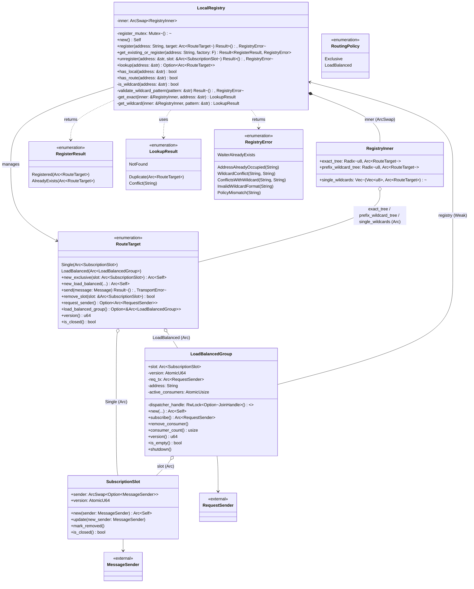

```mermaid
classDiagram
    %% Основные структуры и_enums
    
    class LocalRegistry {
        -inner: ArcSwap~RegistryInner~
        -register_mutex: Mutex~()~
        +new() Self
        +register(address: String, target: Arc~RouteTarget~) Result~(), RegistryError~
        +get_existing_or_register(address: String, factory: F) Result~RegisterResult, RegistryError~
        +unregister(address: &str, slot: &Arc~SubscriptionSlot~) Result~(), RegistryError~
        +lookup(address: &str) Option~Arc~RouteTarget~~
        +has_local(address: &str) bool
        +has_route(address: &str) bool
        -is_wildcard(address: &str) bool
        -validate_wildcard_pattern(pattern: &str) Result~(), RegistryError~
        -get_exact(inner: &RegistryInner, address: &str) LookupResult
        -get_wildcard(inner: &RegistryInner, pattern: &str) LookupResult
    }

    class RegistryInner {
        +exact_tree: Radix~u8, Arc~RouteTarget~~
        +prefix_wildcard_tree: Radix~u8, Arc~RouteTarget~~
        +single_wildcards: Vec~(Vec~u8~, Arc~RouteTarget~)~
    }

    class RegisterResult {
        <<enumeration>>
        Registered(Arc~RouteTarget~)
        AlreadyExists(Arc~RouteTarget~)
    }

    class LookupResult {
        <<enumeration>>
        Duplicate(Arc~RouteTarget~)
        Conflict(String)
        NotFound
    }

    class RegistryError {
        <<enumeration>>
        AddressAlreadyOccupied(String)
        WildcardConflict(String, String)
        ConflictsWithWildcard(String, String)
        InvalidWildcardFormat(String)
        WaiterAlreadyExists
        PolicyMismatch(String)
    }

    class RoutingPolicy {
        <<enumeration>>
        Exclusive
        LoadBalanced
    }

    class RouteTarget {
        <<enumeration>>
        Single(Arc~SubscriptionSlot~)
        LoadBalanced(Arc~LoadBalancedGroup~)
        +new_exclusive(slot: Arc~SubscriptionSlot~) Arc~Self~
        +new_load_balanced(...) Arc~Self~
        +send(message: Message) Result~(), TransportError~
        +remove_slot(slot: &Arc~SubscriptionSlot~) bool
        +request_sender() Option~Arc~RequestSender~~
        +load_balanced_group() Option~&Arc~LoadBalancedGroup~~
        +version() u64
        +is_closed() bool
    }

    class SubscriptionSlot {
        +sender: ArcSwap~Option~MessageSender~~
        +version: AtomicU64
        +new(sender: MessageSender) Arc~Self~
        +update(new_sender: MessageSender)
        +mark_removed()
        +is_closed() bool
    }

    class LoadBalancedGroup {
        +slot: Arc~SubscriptionSlot~
        -dispatcher_handle: RwLock~Option~JoinHandle~()~~
        -version: AtomicU64
        -req_tx: Arc~RequestSender~
        -address: String
        -active_consumers: AtomicUsize
        +new(...) Arc~Self~
        +subscribe() Arc~RequestSender~
        +remove_consumer()
        +consumer_count() usize
        +version() u64
        +is_empty() bool
        +shutdown()
    }

    %% Связи между компонентами
    LocalRegistry *-- RegistryInner : inner (ArcSwap)
    LocalRegistry ..> RegistryError : returns
    LocalRegistry ..> RegisterResult : returns
    LocalRegistry ..> LookupResult : uses
    LocalRegistry --> RouteTarget : manages
    
    RegistryInner o-- RouteTarget : exact_tree / prefix_wildcard_tree / single_wildcards (Arc)
    
    RouteTarget o-- SubscriptionSlot : Single (Arc)
    RouteTarget o-- LoadBalancedGroup : LoadBalanced (Arc)
    
    LoadBalancedGroup o-- SubscriptionSlot : slot (Arc)
    LoadBalancedGroup --> LocalRegistry : registry (Weak)
    
    %% Внешние зависимости (transport)
    class MessageSender {
        <<external>>
    }
    class RequestSender {
        <<external>>
    }
    
    SubscriptionSlot --> MessageSender
    LoadBalancedGroup --> RequestSender
```